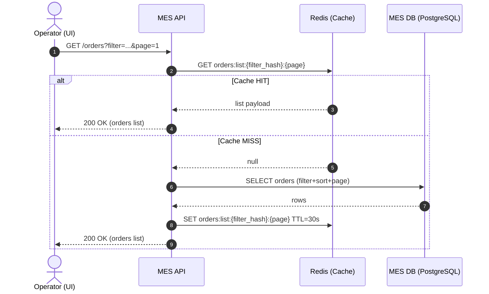
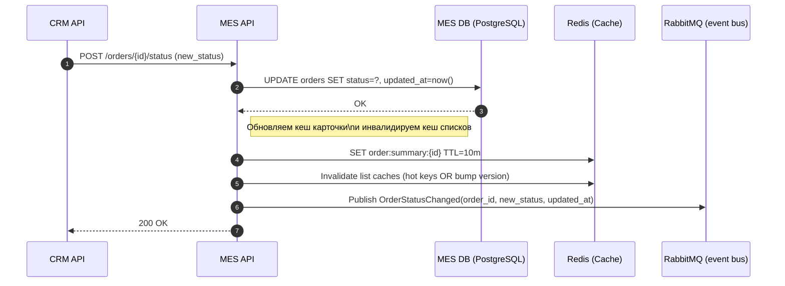

# Архитектурное решение по кешированию (Task 5)

## Контекст и проблема
- Операторы жалуются: **первая страница со списком заказов** (с фильтрами) грузится долго
- Новые клиенты недовольны: **заказ выполняется медленно** (узкое место — тяжёлый расчёт цены в MES)
- MES и БД работают на одном инстансе (read/write вместе), сервисы — по одному инстансу

---

## Мотивация

### Почему нужно кеширование
1. **Снизить нагрузку на MES DB** от повторяющихся чтений
2. **Ускорить “горячие” запросы**: список заказов по типовым фильтрам (статус/дата/оператор) и карточка заказа
3. **Стабилизировать время ответа** при росте числа заказов (рост нагрузки линейный)
4. **Снизить жалобы**: быстрее UI операторов - выше производительность производства

### Что кешируем (целевые точки)
1. **Список заказов для дашборда операторов** (по фильтрам + пагинация)
2. **Карточку заказа / краткое представление** (order summary: статус, цена, оператор, updated_at)
3. *(опционально)* **Результат расчёта цены** для повторяющихся входных данных (одна и та же 3D-модель + параметры расчёта), чтобы:
   - ускорить повторные запросы
   - избегать повторной тяжёлой работы при ретраях/дубликатах

---

## Предлагаемое решение

### Тип кеширования: серверное (основное) + опционально клиентское (вторично)

### Почему серверное
- Проблема — в серверных чтениях (MES API → DB) и общей нагрузке. Клиентское кеширование не разгрузит DB и не ускорит “первую загрузку” для разных операторов
- Серверное кеширование даёт:
  - единый кеш для всех операторов
  - контроль консистентности и инвалидации
  - снижение нагрузки на DB

### Клиентское (опционально)
- Для списка заказов можно добавить **ETag/If-None-Match** или **Cache-Control** на короткое время — это уменьшит время при повторных открытиях, но не решает корневую проблему

---

## Паттерны кеширования и почему

### 3.1. Дашборд операторов (чтение списка заказов) — Cache-Aside + программная инвалидация
**Почему Cache-Aside:**
- минимальные изменения в коде
- кеш заполняется только “нужным” (по факту запросов)
- хорошо подходит для read-heavy запросов с фильтрами/пагинацией

**Почему не Write-Through (для списка):**
- список — это производное представление (фильтры/пагинация/сортировки), писать “все варианты” в кеш при каждом изменении статуса слишком дорого

**Почему не Refresh-Ahead (как базовый):**
- сложно предсказывать все фильтры, можно добавить позже только для самых популярных (например, “по статусу NEW/IN_PROGRESS, первая страница”)

### 3.2. Карточка заказа (order summary) — Write-Through (или Write-Around) + TTL
**Почему:**
- при смене статуса/назначении оператора можно сразу обновлять краткое представление заказа в Redis
- чтение карточки тогда почти всегда O(1) и быстрый ответ

### 3.3. Результат расчёта цены (опционально) — Cache-Aside + TTL + защита от “cache stampede”
Ключ: `price:{model_hash}:{params_hash}`  
**Почему:**
- есть шанс повторов (ретраи, партнёрские интеграции, одинаковые модели/параметры)
- дорого считать повторно
- TTL предотвращает вечное хранение и уменьшает риск устаревания (если алгоритм/цены меняются)

---

## Диаграмма последовательности

### Чтение списка заказов (Cache-Aside)

Сущности кеширования: MES API, Redis, MES DB.
Ключ кеша: orders:list:{filter_hash}:{page}, TTL 10–60s (старт 30s).

### Изменение статуса заказа (запись + обновление/инвалидация кеша)

Сущности кеширования: MES API, Redis, MES DB.
Обновление карточки: order:summary:{id} (Write-Through).
Инвалидация списков: по ключу (hot keys) или версионирование ключей + TTL как страховка.

---

## Стратегия инвалидации кеша

**Выбранная стратегия:** комбинированная

- Программная по ключу (основная)
- TTL как страховка (на случай ошибок инвалидации)

### Почему так

- **Только TTL:** риск, что операторы увидят устаревшие данные до истечения TTL.
- **Только программная:** риск «утечек» ключей / ошибок → данные могут устареть навсегда.
- **Комбинация** даёт управляемую консистентность + защиту.

### Как именно инвалидируем

#### Для карточки заказа

- **Ключ:**  
  `order:summary:{order_id}`
- При изменении статуса:
  - обновляем ключ (write-through)
  - TTL (например, 10–30 минут)

#### Для списков заказов

**Проблема:** списков много (фильтры / страницы). Поэтому:

- **TTL короткий:** 10–60 секунд (подбирается по UX)
- **Программная инвалидация:**
  - удаляем только «горячие» ключи, которые реально используются чаще всего  
    (например, первые страницы по статусам)
  - либо используем версионирование списков

#### Версионирование списков

Ключи вида: `orders:list:v:{filter_hash}:{page}`
- при изменении статуса увеличиваем `version` для группы (например, по статусу или глобально)
- старые ключи «умирают» сами по TTL

#### Рекомендуемый практичный вариант

- `orders:list:{filter_hash}:{page}`
- `TTL = 30s`
- Инвалидация только топовых фильтров:
  - `status = MANUFACTURING_STARTED`
  - `status = PRICE_CALCULATED`
  - `status = SUBMITTED`
- `page = 1..N`

## Сравнительная таблица (почему выбран Cache-Aside)

| Паттерн | Плюсы | Минусы | Где применяем |
|--------|------|--------|---------------|
| Cache-Aside | Простой, кешируется только востребованное, меньше изменений | Нужно аккуратно решать инвалидацию/шторм запросов | Списки заказов, price cache |
| Write-Through | Консистентность для конкретного объекта, быстрое чтение | Не подходит для “производных” представлений (списки/фильтры) | Карточка заказа (order summary) |
| Refresh-Ahead | Очень быстрые ответы на “горячие” запросы | Нужно предсказывать что “горячее”, сложнее поддержка | Опционально позже для топ-фильтров |

## Результат (ожидаемый эффект)
- Дашборд операторов: значительное снижение latency (особенно на первой странице и повторных запросах)
- Снижение read-нагрузки на MES DB
- Меньше жалоб операторов
- (Опционально) ускорение повторных запросов расчёта цены при дубликатах/ретраях
